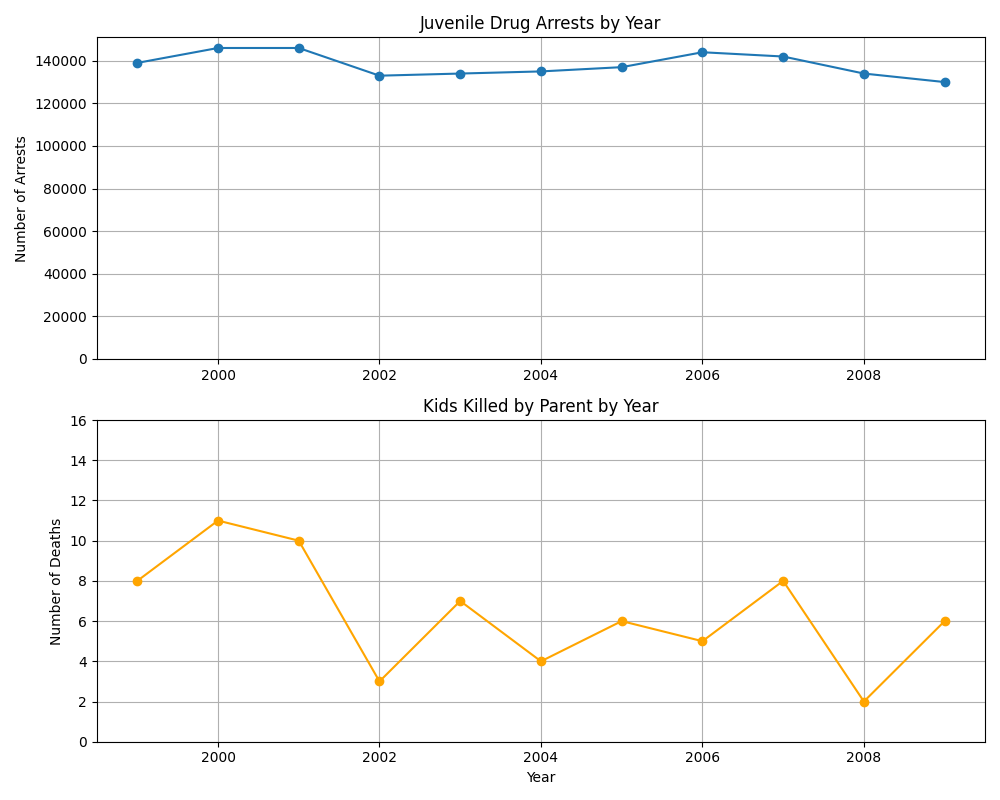
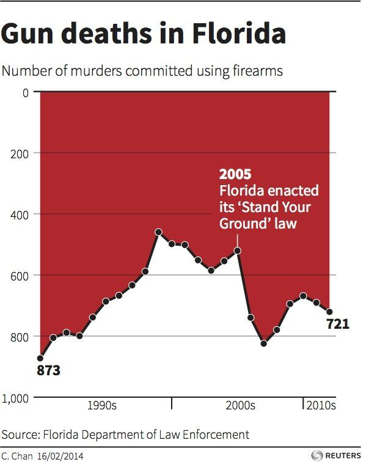
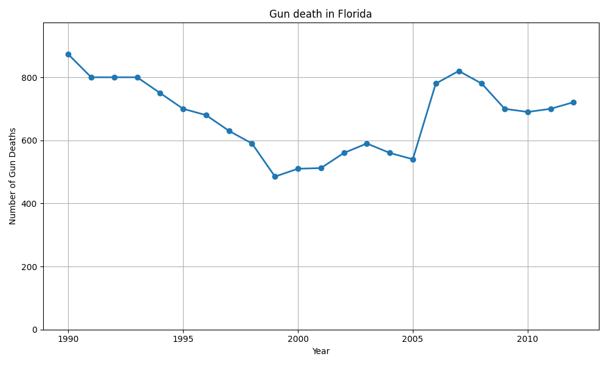
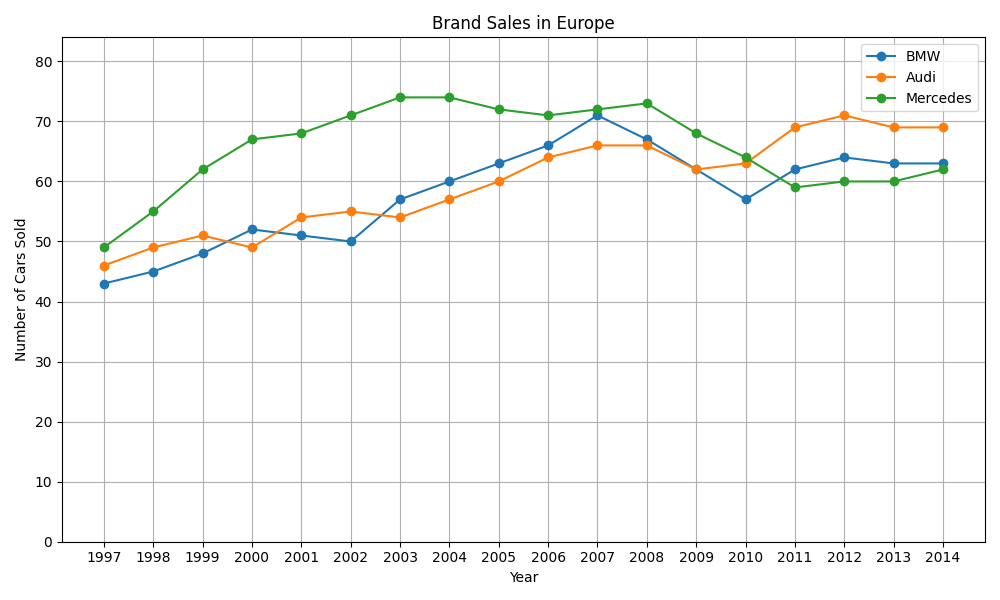

### Figure 1 ###

### 1. DATA

|  | Criterion | Description |
|-----|-----------|------------|
| Y | chart type ||
| Y | valid interpolation |  |
| Y | sufficient data | |
| Y | Curve building method clear |  |
| N | Confidence intervals shown |  |
| N/A | Histogram steps | Not a histogram |
| N/A | Histograms show probabilities | Not a histogram |

### 2. GRAPHICAL OBJECTS

| | Criterion | Description |
|-----|-----------|------------|
| Y | Readable on print/screen | |
| N | Standard color range | not colorblind-friendly |
| Y | Axes identified and labelled |  |
| Y | Scales and units explicit |  |
| Y | Curves cross without ambiguity | |
| N | Grids help reader | No grid |

### 3. ANNOTATIONS

|  | Criterion | Description |
|-----|-----------|------------|
| Y | Axes labelled by quantities | not labelled, but obvious from context |
| N | Labels self-contained | One of the labels includes US, the other does not |
| N | Units on axes | No units, but is ovious |
| Y | Axes oriented correctly |  |
| N | Origin (0,0) or justified | Both Y-axis truncated, not justified |
| Y | No holes on axes |  |
| N/A | Order of bars is logical | Not a bar chart |
| Y | Each curve has legend |  |
| N/A | Each bar has legend | Not a bar chart |

### 4. INFORMATION

|  | Criterion | Description |
|-----|-----------|------------|
| N | Curves on same scale | Different scale |
| Y | Curve count | |
| N | Curves comparable on same graphic | dual y-axis |
| Y | No redundant curves |  |
| N | Gives relevant information | fake correlation |
| N | Error bars for averages | |
| N | Cannot remove objects | Remove US from label add it to title |

### 5. CONTEXT

|  | Criterion | Description |
|-----|-----------|------------|
| N/A | Symbols defined | No text |
| N | More info than alternatives | seperate plots would be better|
| N | Has title | |
| N/A | Title self-contained | No title to evaluate |
| N | Referenced/sourced | No Source |
| N/A | Text-figure relation | No text |

**Critical Issues:*
- Dual Y-axis can be misleading (implies correlation)
- Truncated Y-axes hide differences
- No title
- No source
- Poor color choice (not colorblind-friendly)

### Improved Version

### Figure 2 ###

### 1. DATA

|  | Criterion | Description |
|-----|-----------|------------|
| Y | chart type ||
| Y | valid interpolation |  |
| Y | sufficient data | |
| Y | Curve building method clear |  |
| N | Confidence intervals shown |  |
| N/A | Histogram steps | Not a histogram |
| N/A | Histograms show probabilities | Not a histogram |

### 2. GRAPHICAL OBJECTS

| | Criterion | Description |
|-----|-----------|------------|
| Y | Readable on print/screen | Printing uses too much ink |
| Y | Standard color range |  |
| N | Axes identified and labelled | No labels |
| N | Scales and units explicit | decades are shown instead of years, confusing |
| N/A | Curves cross without ambiguity | |
| Y | Grids help reader | Yes, but x-axis grid would be helpful too |

### 3. ANNOTATIONS

|  | Criterion | Description |
|-----|-----------|------------|
| Y | Axes labelled by quantities | not labelled, but obvious from context |
| N | Labels self-contained | No labels |
| N | Units on axes | No units, but is obvious |
| N | Axes oriented correctly | Y-axis reversed, very misleading |
| Y | Origin (0,0) or justified | Since it is years, it is justified |
| Y | No holes on axes |  |
| N/A | Order of bars is logical | Not a bar chart |
| N | Each curve has legend |  |
| N/A | Each bar has legend | Not a bar chart |

### 4. INFORMATION

|  | Criterion | Description |
|-----|-----------|------------|
| Y | Curves on same scale | |
| Y | Curve count | |
| N/A | Curves comparable on same graphic |  |
| Y | No redundant curves |  |
| Y | Gives relevant information |  |
| N | Error bars for averages | |
| Y | Cannot remove objects | |

### 5. CONTEXT

|  | Criterion | Description |
|-----|-----------|------------|
| N/A | Symbols defined | No text |
| N | More info than alternatives | Reverse Y-axis would be better |
| Y | Has title | |
| Y | Title self-contained |  |
| Y | Referenced/sourced | |
| N/A | Text-figure relation | No text, but probably misleading |

**Summary of Main Issues:**
- Reverse Y-axis is very misleading
- X-axis decades instead of years is confusing
- No X-axis labels, cannot tell when data starts and ends

### Improved Version

### Figure 3 ###

### 1. DATA

|  | Criterion | Description |
|-----|-----------|------------|
| Y | chart type ||
| Y | valid interpolation | Hard to determine given the lack of grid |
| Y | sufficient data | |
| Y | Curve building method clear |  |
| N | Confidence intervals shown |  |
| N/A | Histogram steps | Not a histogram |
| N/A | Histograms show probabilities | Not a histogram |

### 2. GRAPHICAL OBJECTS

| | Criterion | Description |
|-----|-----------|------------|
| Y | Readable on print/screen | I cannot map the years to the data in the lack of grid lines|
| Y | Standard color range |  |
| N | Axes identified and labelled | No labels |
| Y | Scales and units explicit |  |
| Y | Curves cross without ambiguity | |
| N | Grids help reader | No grid |

### 3. ANNOTATIONS

|  | Criterion | Description |
|-----|-----------|------------|
| Y | Axes labelled by quantities | not labelled, but obvious from context |
| N | Labels self-contained | No labels |
| N | Units on axes | No units, but is obvious |
| Y | Axes oriented correctly |  |
| Y | Origin (0,0) or justified | not justified |
| Y | No holes on axes |  |
| N/A | Order of bars is logical | Not a bar chart |
| N | Each curve has legend |  |
| N/A | Each bar has legend | Not a bar chart |

### 4. INFORMATION

|  | Criterion | Description |
|-----|-----------|------------|
| Y | Curves on same scale | |
| Y | Curve count | |
| N/A | Curves comparable on same graphic |  |
| Y | No redundant curves |  |
| Y | Gives relevant information |  |
| N | Error bars for averages | |
| Y | Cannot remove objects | |

### 5. CONTEXT

|  | Criterion | Description |
|-----|-----------|------------|
| N/A | Symbols defined | No text |
| Y | More info than alternatives |  |
| Y | Has title | |
| Y | Title self-contained |  |
| N | Referenced/sourced | |
| N/A | Text-figure relation | |

**Summary of Main Issues:**
- Lack of grid lines makes it that I cannot map the years to the data, making it unreadable
- No source
- truncated Y-axis is not justified

### Improved Version

