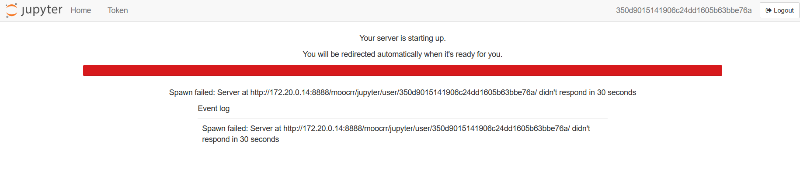

### Scientific Methodology and Performance Evaluation - Spring 2025

## Homeworks 
- [Challenger Disaster](challenger)
- [Figure Critique](figure_criticism)
- [Quicksort](https://github.com/danielramel/M2R-ParallelQuicksort)
- [Influenza](influenza)

Disclaimer:
Unfortunately I could not get any of the jupyter servers in the MOOC section to work, they kept giving me the following error:

For this reason I used some alternative works. I hope they are still relevant to the course. You can find the links to the reports in the respective folders.